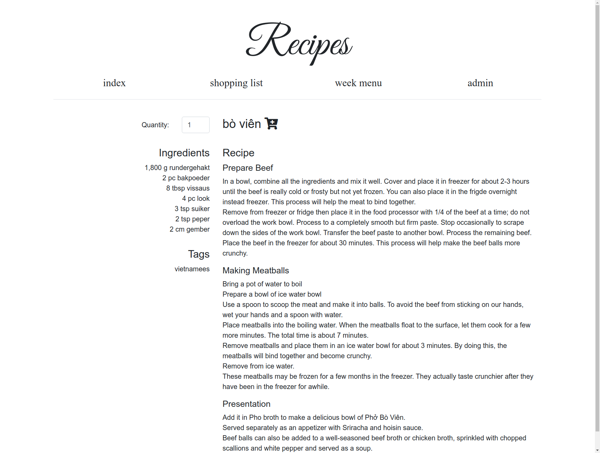
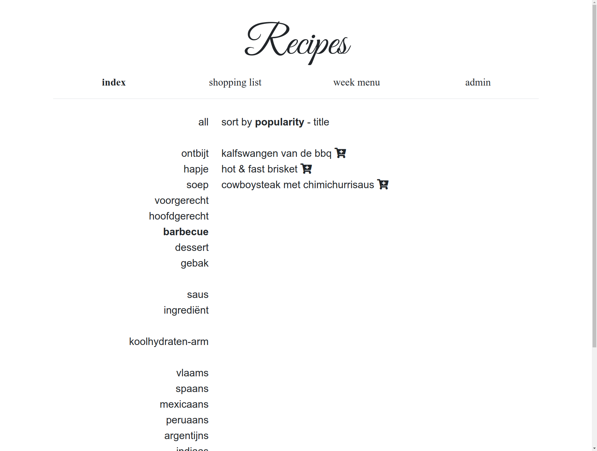
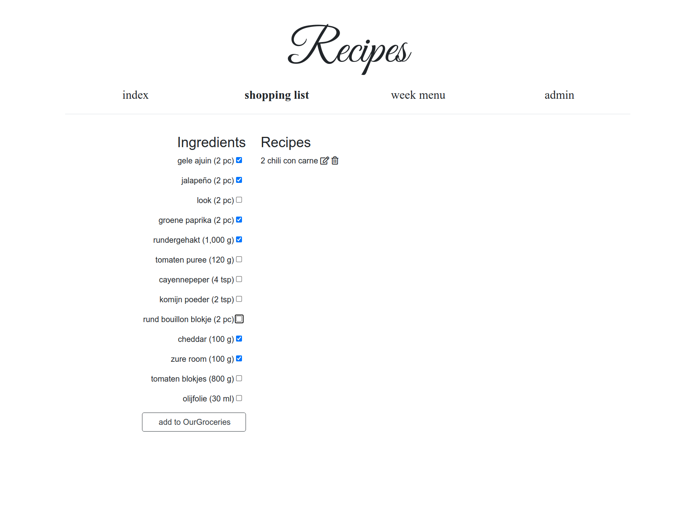
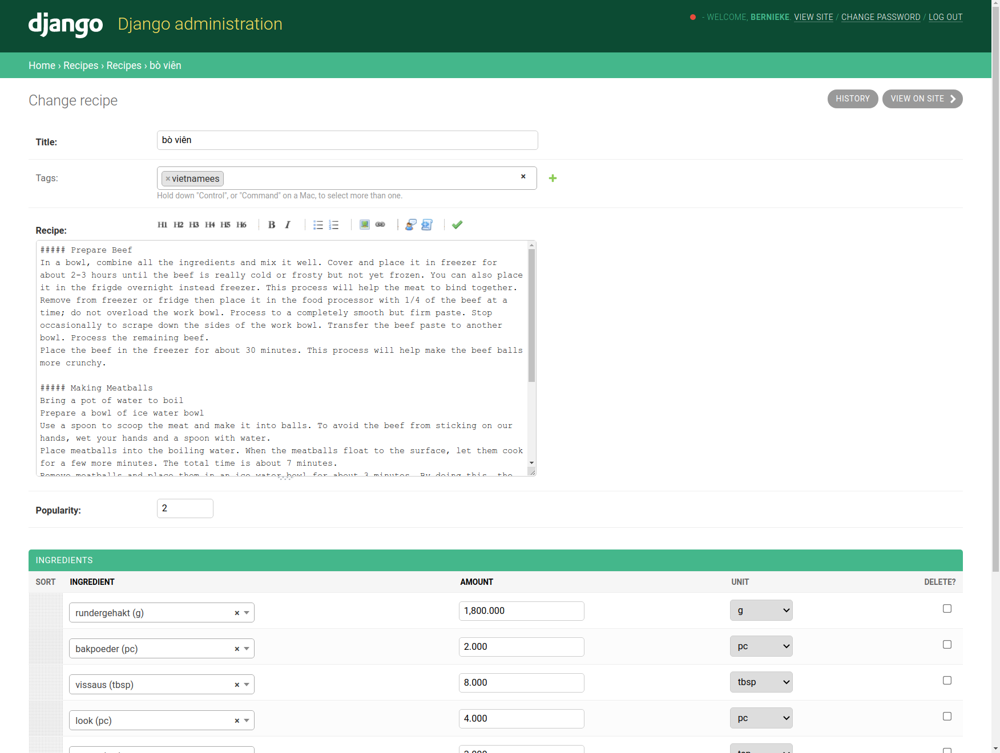

recipes
=======

This is a Django application for keeping recipes and creating shopping lists which can be sent to [OurGroceries](https://www.ourgroceries.com).

It can be easily deployed using docker (against an existing PostgreSQL database or using an internal SQLite database) or as a full stack with PostgreSQL and nginx using docker-compose.

screenshots
===========











deploy using docker-compose
===========================

```
docker-compose up -d && \
docker exec -it recipes_recipes_1 /opt/recipes/manage.py createsuperuser
```

When upgrading you will need to capture the Django SECRET_KEY to avoid having all your existing sessions invalidated.
```
docker pull bernieke/recipes && \
DJANGO_SECRET_KEY="`docker exec recipes_recipes_1 cat /opt/recipes/secret.key`" docker-compose up -d && \
docker image prune -f
```


configuration
=============

Gunicorn can be configured by adding additional environment variables to the recipes container prefixed by GUNICORN_ (so GUNICORN_WORKERS will become the setting WORKERS in gunicorn).

The nginx.conf file can be modified to change the nginx config.

Configuration of the docker image is done by following environment variables (these are already configured in docker-compose.yml):

* GUNICORN: set to 1 to use Gunicorn instead of runserver (Django DEBUG will also be set to False)
* SQL_ENGINE: the Django database engine to use (defaults to django.db.backends.sqlite3; set to django.db.backends.postgresql for PostgreSQL)
* SQL_DATABASE: the database name (or path for sqlite; defaults to /var/lib/recipes/db.sqlite3 if /var/lib/recipes exists, otherwise ./db.sqlite3)
* SQL_USER: the database user (only for PostgreSQL)
* SQL_PASSWORD: the database password (only for PostgreSQL)
* SQL_HOST: the database hostname (only for PostgreSQL)
* SQL_PORT: the database port (only for PostgreSQL)


build and run development container
===================================

```
docker rm -vf recipes; \
docker image rm recipes; \
docker image prune -f; \
docker build . -t recipes --force-rm && \
docker create --name recipes -p 8000:8000 recipes && \
docker start recipes && \
docker logs recipes -f
```


run directly
============

```
pip install -r requirements.txt
DEBUG=1 ./manage.py runserver
```